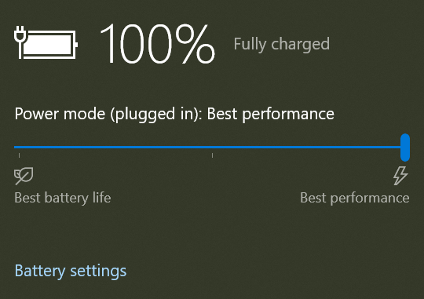
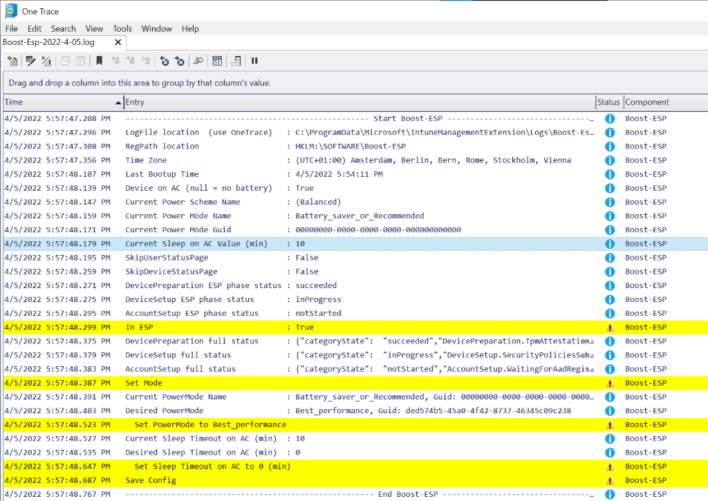

# Boost ESP
This is a **proof of concept**, if setting Best_performance mode and disabling sleep during the Enrollment Status Page (ESP) decreases the deploy time and avoids the devices going into sleep mode.


## [Install-ESPBoost.ps1](Install-ESPBoost.ps1) 

registers a **scheduled task**, that runs as **system**. It has a trigger on **system startup**. It **runs a powershell script** that is hosted **online**. In this case the [Boost-ESP.ps1](Boost-ESP.ps1) script. The scheduled task **expires** and therefore destroys itself after a given period of time. 

⚠️⚠️ **_change the URI to your hosted version of Boost-ESP.ps1_** ⚠️⚠️ 

I don't want system privileges on your systems. 
You could for instance fork the repository.

All the **$PSDefaultParameterValues** are for you to change

```powershell
$PSDefaultParameterValues = @{
    "Install-ScheduledTask:Uri"               = "https://raw.githubusercontent.com/MrWyss-MSFT/boost-esp/main/Boost-ESP.ps1"
    "Install-ScheduledTask:TimeToLiveInHours" = 6
    "Install-ScheduledTask:Author"            = "MrWyss-MSFT"
    "Install-ScheduledTask:TaskName"          = "Boost-ESP"
}
```
This script is meant to be added in Endpoint Admin Manager admin center (Intune) _Devices | Scripts_. Simply upload the **modifed** script and assign it to your e.g. autopilot devices. Once run, usually early on in the ESP, it registers the scheduled task which in turn, runs the other script specified in Install-ScheduledTask:Uri every boot.

## [Boost-ESP.ps1](Boost-ESP.ps1)
This script goal is to configure **two** power related settings, **while** the device is in **ESP**. It will save the original values to the registry and **reverts back** to them, once the machine is out of the ESP.

1️⃣ set power mode to **Best performance**



2️⃣ and the **sleep** settings when plugged in aka **AC** to **never**


- Power Mode to Best performance is to speed up the deployment. e.g. Autopilot
- Sleep timeout to never is to avoid devices going to sleep, which usually breaks the ESP flow and can't be aborted.


There a few customization you can make in the script, remember you need to __host this file on your own__.
```powershell
#region vars
$modes = @{ 
    # These power mode guid's may be different on some devices
    "Battery_saver_or_Recommended" = [guid] "00000000-0000-0000-0000-000000000000"
    "Better_performance"           = [guid] "3af9b8d9-7c97-431d-ad78-34a8bfea439f"
    "Best_performance"             = [guid] "ded574b5-45a0-4f42-8737-46345c09c238" 
}

$DesiredModeGuid = $modes.Best_performance.Guid
$DesiredSleepTimeoutOnACInMinutes = 0 

$PSDefaultParameterValues = @{
    "*-Config:RegPath"        = "HKLM:\SOFTWARE\Boost-ESP"
    "Write-Log:Path"          = $env:ALLUSERSPROFILE + "\Microsoft\IntuneManagementExtension\Logs\Boost-Esp-$(Get-Date -Format yyyy-M-dd).log"
    "Write-Log:Component"     = "Boost-ESP"
    "Write-Log:Type"          = "Info"
    "Write-Log:ConsoleOutput" = $True
}
#endregion
```

You might have different mode guids for different oem devices. I am not sure about this yet.
Registry Path as to where it saves the original power settings values.

## Logging
If not changed the default log location is **C:\ProgramData\Microsoft\IntuneManagementExtension\Logs\Boost-Esp-yyyy-M-dd.log**. 

Few tips:

- The log file is best viewed with **OneTrace** as it uses a monospaces font.
- Some lines contain json, copy the Json part to a file or a here-string and use **ConvertFrom-Json** to have it human readable
- The log can be collected with the Intune's **Collect diagnostics** built-in feature 

## Notes
- Interestingly, If you **wipe** a device from Intune, the **power mode is preserved**. So make sure it's set to your desired start value before you wipe.
- Reboots during the device phase causes another user cred prompt. Make sure none of your apps or configs do so.
  - for the configs check Computer\HKEY_LOCAL_MACHINE\SOFTWARE\Microsoft\Provisioning\SyncML\RebootRequiredURIs
- The report **Autopilot deployment (preview)** under Devices Monitor, shows the deployment start, end and total time. 
  - The start time is when your user authenticate on the first autopilot logon prompt. 
  - The end time is when the desktop is show or at the windows hello enrollment prompt.
## ToDo
- [x] Better ESP completion test, this is currently hit and miss
- [ ] Win11 test and screenshot
- [ ] Test with SkipUserStatusPage
- [ ] make sure that the scheduled task is run again without reboot once the desktop is loaded

## Contribution
please do